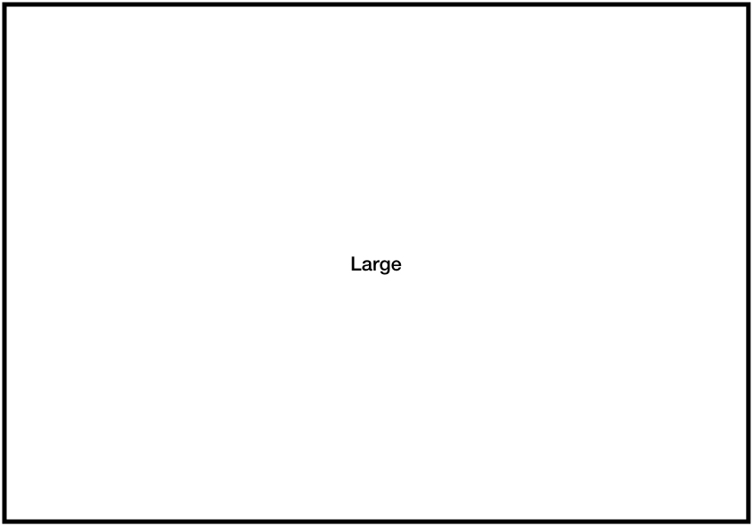

# Markdown to PDF

## Overview

This document describes how to convert a Markdown document into a readable PDF file. For this purpose we use a Markdown extension called `MultiMarkdown`. For more details about MultiMarkdown syntax see also <https://github.com/fletcher/MultiMarkdown/wiki/MultiMarkdown-Syntax-Guide>.

This document is written as a sample for any upcoming documents, which will not be written in Microsoft Word anymore, but in Markdown format for better maintaining documents by a team and Pull-Requests to a common repository.

## General way of writing markdown

The goal is to use this as a template for further documents. So we tried to put the whole content into this or more markdown files only. Only the styling is either up to a customization (done via .tex file) or by variable definition during build process.

These files are relevant:

* general information about the document: `metadata.yaml`
* all markdown files: `01_Main.md`, `02_OpenIssues.md`, probably more
* the customization tex file: `customize.tex`

At the moment we use the standard latex template. If needed this could be changed by generating the latex file by `pandoc --print-default-template=latex > src/markdown/template.latex` and rename the file `template.latex` to `mytemplate.latex` and use that during build with `--template=mytemplate.latex`.

The markdown file can also contain internal comments which will **NOT** be processed into the output file. Such comments have t start with `[comment #1]: # some comment` and will be discarded by Pandoc. If you have more comments just give them a unique number otherwise pandoc will complaing with warnings.

[comment #1]: # (This is an internal comment only which will NOT be included in generated file)

## Document header

You can add in first lines of document meta data, like title, author and more. For more information see <https://github.com/fletcher/MultiMarkdown/wiki/MultiMarkdown-Syntax-Guide#metadata>.

In Pandoc you have to add the extension `+mmd_title_block` to enable process of that kind of metadata.

## Document generation

The basic look & feel of the generated PDF can be configured when calling Pandoc for processing of Markdown.

### Page layout

The general document style and page layout can be defined by variables support by default LaTeX template.
We used the `article` layout and defined the margins of the document.

```shell
--variable documentclass:article \
--variable papersize:a4paper \
--variable classoption:openright \
--variable geometry:"left=2cm, right=2cm, top=3cm, bottom=2cm" \
```

### Default fonts used

We can also define the default fonts and fontsize.

```shell
--variable mainfont="Palatino" \
--variable sansfont="Helvetica" \
--variable monofont="Menlo" \
--variable fontsize=12pt \
```

### Hyperlink styling

We can also define how hyperlinks will be generated.

```shell
--variable colorlinks \
--variable urlcolor=blue \
```

## Table Of Contents, Figures, Tables

A Table Of Contents can be added to document by adding `--toc --toc-depth=N` to commandline options.
With `--toc-depth` you can specify how many levels should be included. If specifying `--toc-depth=2` you will only see chapters to level 2, not deeper ones.

With the commandline option `--number-sections` the chapters can also be enumerated.

Use following sub-chapters if you want to check different depth of table of contents.

With the LaTeX option `\renewcommand{\contentsname}{Table of Contents}` you can change the name of the table of contents to your indivdual one.

With the commandline options `--variable lof` (list of figures) and `--variable lot` (list of tables) these sections will be added to the PDF. They will appended to the `Contents` section.

If they should disappera, the basic `template.latex` would need to be changed.

Summary of all commandline options:

```shell
--toc --toc-depth=3 --number-sections \
--variable lof \
--variable lot \
```

## Customization via tex files

A tex file can be included *before* the markdown will be added. On commandline with `--include-in-header=filename.tex` you can specify a tex file to be processed first. We use as default here the `customization.tex` file with some adaptions for header/footer.

# Supported options in MultiMarkdown

## Normal Text

Simple write normal paragraphs. You can use also `quoting` (using normal ``\`some text\`` notation) to mark text as code in plain text. _Emphasized with underscore_ text, *Emphasized with stare* text, **strong emphasized** text, *italic* text, ~~strikeout~~ text.

## Lists

Nested lists needs to be indented by 4 spaces.

* Bullet 1
    * Sub-Ballet 1
        * Sub-Sub-Ballet 1
* Bullet 2

    1. 2-a
    1. 2-b
    1. 2-c


Ordered lists will be numbered automatically, indent sublists.

1. Entry 1

    1. 1-a
    1. 1-b
    1. 1-c

1. Entry 2
1. Entry 3

## References

We can refer to other chapters, e.g. to "Open Issues". See [Open Issues](#open-issues). This does only work for cross references to headers.

See https://pandoc.org/MANUAL.html#header-identifiers how headers will be represented as references.

A header can be annotated to have an explicite reference using `## header-text {#refToheader}`.

## Code Samples

You can include code snippets in different languages. Pandoc extension `+backtick_code_blocks` needs to be enabled. See <https://pandoc.org/MANUAL.html#fenced-code-blocks>

Here is a sample of a shell script.

[comment #2]: # (This "_ _ _ " will create a horizontal line)

_ _ _
```shell
$ pandoc -o MarkdownToPDF.pdf MarkdownToPDF-Main.md
```
_ _ _

Here is a Java sample:

_ _ _
```java
public static void main(String[] args) {
  // some code
}
```
_ _ _


## Footnotes

There is also support to add footnotes[^footnote1] within the document. Footnotes will be added to current page on the botton.[^footnoteWithLink]. Normally do not use any blanks between text and the footnote reference. Footnotes can also include multi lines, see here[^footnoteWithLongText]. This does not yet work really.

[^footnote1]: This is a sample footnote on a page.
[^footnoteWithLink]: For more details see <https://github.com/fletcher/MultiMarkdown/wiki/MultiMarkdown-Syntax-Guide#footnotes>.
[^footnoteWithLongText]: A very long text can also be used.
  next part of the long text
  `some code pieces`

## Images

Images can be included via ``. Captions will be added if a caption text is specified.


Images can be used in different formats: JPEG, PNG, or TIFF. The can be integrated in text flow {width=1cm height=1cm}\ and like used here {width=24px height=24px}\ following more text. Images in text flow will not get a caption, as all standalone images will get a caption based on image text.

Large images can be resized, e.g. by adding `{width=50% height=50%}` to the image definition. Either in `%`, `px` or `cm`.

{width=50% height=50%}

### Sub-Sub-Chapter, Level 3

#### Sub-Sub-Sub-Chapter, Level 4

##### Sub-Sub-Sub-Sub-Chapter, Level 5

## Tables

This includes a so named Grid table. A caption can be used, will be numbered automatically.
For more information on other tables see <https://pandoc.org/MANUAL.html#tables>.

Table: References (as Pipe Table)

Description                  |Link
:----------------------------|:-------------------------------------
MultiMarkdown Specification  |<http://fletcherpenney.net/multimarkdown/>
MultiMarkdown Cheat-Sheet    |<https://rawgit.com/fletcher/human-markdown-reference/master/index.html>

Table: References (as Grid Table)

+---------------------------------------------------------------------------+-----------------------------+
| Link                                                                      | Description                 |
+===========================================================================+=============================+
| <http://fletcherpenney.net/multimarkdown/>                                | MultiMarkdown Specification |
+---------------------------------------------------------------------------+-----------------------------+
| <https://rawgit.com/fletcher/human-markdown-reference/master/index.html>  | MultiMarkdown Cheat-Sheet |
+---------------------------------------------------------------------------+-----------------------------+

## Controlling page flow

With the plain `\newpage` LaTeX instruction a new page can be enforced. With the `\breakpage` a conditional page break can be defined.

See chapter [References](#referencesLinks) for a sample.

For more details see <https://tex.stackexchange.com/questions/736/pagebreak-vs-newpage>.


\newpage

# Appendix

## References {#referencesLinks}

This chapter contains useful links to external resources. As unordered list with multiple indentation.

* MultiMarkdown Cheat-Sheet: <https://rawgit.com/fletcher/human-markdown-reference/master/index.html>
* Syntax Guide: <https://github.com/fletcher/MultiMarkdown/wiki/MultiMarkdown-Syntax-Guide>
* Pandoc Tricks: <https://github.com/jgm/pandoc/wiki/Pandoc-Tricks>
    * Left aligned tables: <https://github.com/jgm/pandoc/wiki/Pandoc-Tricks#left-aligning-tables-in-latex>
    * Today: <https://github.com/jgm/pandoc/wiki/Pandoc-Tricks#today-in-date-metadata>
* Pandoc Goodies project: <https://github.com/tajmone/pandoc-goodies/tree/master/pp>
* Pandoc User Templates: <https://github.com/jgm/pandoc/wiki/User-contributed-templates>
    * PhD thesis: <https://github.com/chiakaivalya/thesis-markdown-pandoc>
        * good Tex template: <https://github.com/chiakaivalya/thesis-markdown-pandoc/blob/master/preamble.tex>
* CSS styling
    * <https://stackoverflow.com/questions/23825317/how-to-convert-markdown-css-pdf>
    * <https://gist.github.com/killercup/5917178>

## ChangeLog

Table: Document change history

+---------+-----------------+---------------+
| Version | Description     | Author        |
+=========+=================+===============+
| v01     | initial version | Jochen Hiller |
+---------+-----------------+---------------+
| v02     | improvements    | Jochen Hiller |
+---------+-----------------+---------------+
